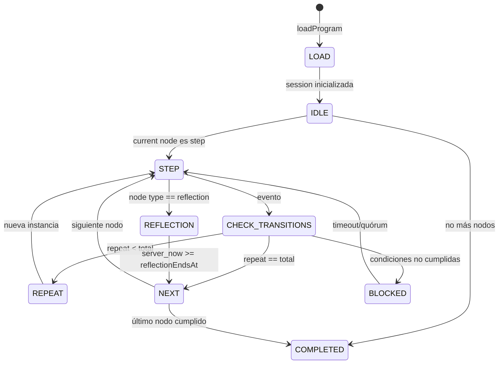
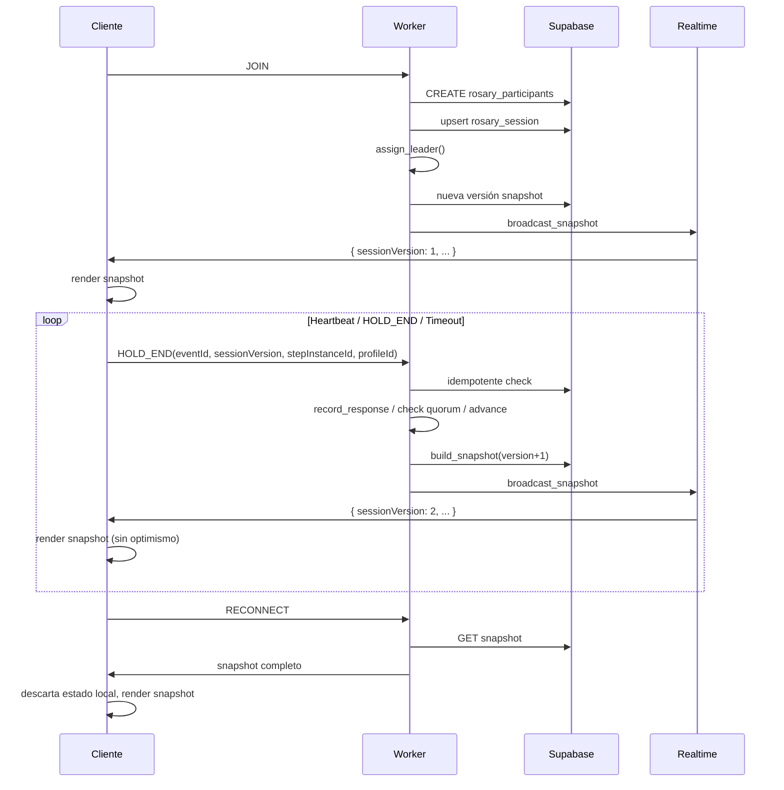

# Máquina de estados: Rosario en vivo

## 1. Estados y subestados

### Conexión del cliente

```text
CONNECTING
  ├── SUBSCRIBED → CONNECTED
  ├── TIMEOUT → RECONNECTING (backoff exponencial)
  └── CLOSED → OFFLINE

RECONNECTING
  ├── RESYNC_OK → CONNECTED
  ├── TIMEOUT → RECONNECTING (backoff aumenta)
  └── FATAL → FATAL (limpiar y mostrar error recuperable)

CONNECTED
  └── CLOSED / ERROR → RECONNECTING

STALE
  └── Snapshot del servidor con `sessionVersion` mayor al local
      → CONNECTED (tras resync completo)

OFFLINE
  └── ONLINE → CONNECTING

FATAL
  └── Acción del usuario → detener UI
```

### Sesión mundial (en el Worker / snapshot)

```text
JOINING
  └── min_participants (1) → ACTIVE

ACTIVE
  ├── STEP_TYPE = REFLECTION → REFLECTION
  ├── STEP completado → NEXT_STEP
  └── Último STEP completado → COMPLETED

REFLECTION
  ├── 120s servidor cumplidos → NEXT_STEP
  ├── LEADER persiste REFLECTION? → REFLECTION (prórroga no permitida por diseño)
  └── Sesión finalizada → COMPLETED

NEXT_STEP
  └── nuevo step cargado → ACTIVE

COMPLETED
  └── No más transiciones
```

## 2. Eventos aceptados por estado

| Evento | CONNECTING | CONNECTED | RECONNECTING | STALE | OFFLINE | FATAL | ACTIVE | REFLECTION | COMPLETED |
|--------|------------|-----------|--------------|-------|---------|-------|--------|------------|-----------|
| JOIN | ✓ | ✓ | ✓ | ✓ | ✓ | ✗ | ✓ (via Worker) | ✓ (via Worker) | ✗ |
| LEAVE | ✗ | ✓ (cleanup) | ✓ (cleanup) | ✓ (cleanup) | ✗ | ✗ | ✓ (via Worker) | ✓ (via Worker) | ✗ |
| HEARTBEAT | ✗ | ✓ (autoservicio) | ✗ | ✗ | ✗ | ✗ | ✓ (via Worker) | ✓ (via Worker) | ✗ |
| HOLD_START | ✗ | ✓ (gesto intención) | ✗ | ✗ | ✗ | ✗ | ✓ (vía Worker) | ✗ | ✗ |
| HOLD_END | ✗ | ✓ (gesto intención) | ✗ | ✗ | ✗ | ✗ | ✓ (vía Worker) | ✗ | ✗ |
| CHAT_SEND | ✗ | ✗ | ✗ | ✗ | ✗ | ✗ | ✗ | ✓ (solo aquí) | ✗ |
| VOICE_NOTE_SEND | ✗ | ✗ | ✗ | ✗ | ✗ | ✗ | ✗ | ✓ (solo aquí) | ✗ |
| PAUSE_REQUEST | ✗ | ✓ (liderazgo) | ✗ | ✗ | ✗ | ✗ | ✓ (vía Worker) | ✗ | ✗ |
| RESUME_REQUEST | ✗ | ✓ (liderazgo) | ✗ | ✗ | ✗ | ✗ | ✓ (vía Worker) | ✗ | ✗ |
| RESYNC_SNAPSHOT | ✗ | ✗ | ✓ (forzado) | ✓ | ✗ | ✗ | ✗ | ✗ | ✗ |

## 3. Snapshot autoritativo mínimo

```typescript
interface RosarySnapshot {
  sessionId: string;
  sessionVersion: number;           // monotónico, único por transición
  devotionId: string;
  sectionId: string;                // "module-misterio" u otro módulo actual
  stepId: string;                   // "step-ave-maria-x10"
  stepInstanceId: string;           // id de instancia concreta en ejecución
  stepType: StepType;               // "repeated_prayer" | "prayer" | "mystery" | "reflection" | ...
  repeatIteration: number;          // 1..repeatTotal
  repeatTotal: number;              // 10 para Ave María
  phase: "step" | "reflection" | "completed";
  leaderParticipantId: string | null;
  stepStartedAt: string;            // ISO del servidor
  stepEndsAt: string;               // ISO del servidor (durationMs desde stepStartedAt)
  reflectionEndsAt: string | null;  // ISO del servidor (120s desde inicio reflection)
  status: "joining" | "active" | "reflection" | "completed" | "error";
  participants: RosaryParticipant[];
}
```

### Invariantes obligatorias

1. `repeatIteration >= 1`
2. `repeatIteration <= repeatTotal`
3. `stepInstanceId` único por instancia de step. Cambiarlo reinicia `repeatIteration`.
4. `sessionVersion` aumenta monotónicamente.
5. Evento duplicado no produce mutación (idempotencia por `eventId` + `sessionVersion`).
6. Solo una transición ganadora por versión.

## 4. Guards

| Transición | Guarda |
|------------|--------|
| JOIN → ACTIVE | `participants.length < max_participants` (sin límite efectivo para mundial) |
| HOLD_END → transición | `event.sessionVersion == snapshot.sessionVersion` AND `event.stepInstanceId == snapshot.stepInstanceId` AND `server_now >= stepStartedAt + minHoldMs` |
| Avance de repeat | `repeatIteration < repeatTotal` |
| STEP → REFLECTION | `stepType == "mystery"` AND `repeatIteration == repeatTotal` (última repetición completada) |
| REFLECTION → NEXT | `server_now >= reflectionEndsAt` |
| Leader desaparece | `server_now - last_heartbeat_at > 5s` → reasignar leader |
| Quórum | `responded_count / eligible_count >= 0.7` AND transición `on_response` |

## 5. Acciones

| Acción | Descripción |
|--------|-------------|
| `record_response` | Marca `participant.isResponding = true` para instancia actual. Idempotente. |
| `assign_leader` | Asigna leader a participante vivo según round-robin determinista. |
| `release_leader` | Limpia leader. |
| `build_snapshot` | Crea nuevo snapshot con `sessionVersion + 1`, avanza step/repeat si corresponde. |
| `broadcast_snapshot` | Emite snapshot por Realtime a todos los suscriptores. |
| `resync_client` | Envía snapshot completo al cliente que se reconectó. |

## 6. Transiciones

### CommunityEngine (Worker-side)

```text
[participante] JOIN
  └── validate(device_id, session_id)
      └── insert rosary_participants (ON CONFLICT DO NOTHING)
          └── si session no existe: create rosary_session, assign leader
              └── recalcular snapshot
                  └── broadcast_snapshot

[participante] HEARTBEAT
  └── update last_heartbeat_at
      └── si leader huérfano (5s): reassign_leader
          └── build_snapshot
              └── broadcast_snapshot (solo si cambió)

[participante] HOLD_END
  └── guard: event.sessionVersion == current.sessionVersion
      AND event.stepInstanceId == current.stepInstanceId
      AND event.profileId in eligible participants
  └── record_response
      └── if became_quorum OR leader_finished + grace_period
          └── if repeatIteration < repeatTotal:
              advance_repeat
          else if stepType == "mystery":
              start_reflection
          else:
              advance_step
      └── build_snapshot
          └── broadcast_snapshot

[servidor] STEP_TIMEOUT
  └── guard: server_now >= stepEndsAt
      AND phase == "step"
  └── if stepType == "mystery":
      start_reflection
  else:
      advance_step
  └── build_snapshot
      └── broadcast_snapshot

[servidor] REFLECTION_TIMEOUT
  └── guard: server_now >= reflectionEndsAt
      AND phase == "reflection"
  └── advance_step
  └── build_snapshot
      └── broadcast_snapshot

[cliente] RECONNECT
  └── GET /api/rosario/snapshot
      └── responde snapshot + version actual
          └── cliente descarta todo estado efímero local
              └── renderiza snapshot
```

### PrayerEngine (puro, determinista)

```text
reduce(snapshot, event) -> newSnapshot | null

Caso: RESPONSE
  └── if event.stepInstanceId != snapshot.stepInstanceId: null (evento tardío)
  └── if event.participant already responded: null (idempotente)
  └── mark_responded(event.participantId)
  └── if satisfied(transitions.on_response):
      advance

Caso: STEP_COMPLETE
  └── advance

Caso: REPEAT
  └── if snapshot.repeatIteration < snapshot.repeatTotal:
      repeatIteration += 1, nuevo stepInstanceId
  └── else:
      advance to next node

Caso: NEXT
  └── advance a siguiente nodo en flatten(program)
```

## 7. Autoridad del reloj

- **Única fuente**: `Date.now()` del Worker.
- El cliente **no decide** transiciones.
- `stepStartedAt`, `stepEndsAt`, `reflectionEndsAt` se calculan en el Worker al construir el snapshot.
- El cliente usa `stepEndsAt` y `reflectionEndsAt` solo para UI; no para lógica de avance.

## 8. Versionado e idempotencia

```typescript
interface TransitionRequest {
  sessionId: string;
  eventId: string;            // UUID del evento (cliente + servidor)
  sessionVersion: number;     // versión snapshot actual del cliente
  stepInstanceId: string;     // instancia a afectar
  eventType: "HOLD_END" | "HEARTBEAT" | "JOIN" | "LEAVE" | ...;
  participantId: string;
  payload?: Record<string, unknown>;
}
```

- El Worker mantiene `rosary_session_transitions(event_id)` único.
- Si `event_id` ya existe → devolver snapshot actual (idempotente).
- Si `sessionVersion` del request < `snapshot.sessionVersion` → rechazar (evento tardío).
- Si `sessionVersion` del request > `snapshot.sessionVersion` → carrera; aceptar solo si CAS exitoso (compare-and-swap).

## 9. Repetición declarativa

No hay contador local. La UI recibe:

```typescript
interface RepeatInfo {
  current: number;   // repeatIteration
  total: number;     // repeatTotal
}
```

El cliente renderiza:

```
Ave María {repeatInfo.current} de {repeatInfo.total}
```

Nunca puede ser `18 de 10` porque el Worker garantiza `1 <= repeatIteration <= repeatTotal` al construir el snapshot.

Ejemplo de definición JSON del paso:

```json
{
  "id": "step-ave-maria-x10",
  "type": "repeated_prayer",
  "title": "Ave María",
  "subtitle": "10 Avemarías",
  "text": "Dios te salve, María...",
  "repeat": 10,
  "durationMs": 6000,
  "requiresResponse": true,
  "roles": [{ "type": "leader" }, { "type": "assembly" }],
  "transitions": [
    { "trigger": "on_quorum", "target": "step-gloria-misterio" }
  ]
}
```

El `repeated_prayer` es un tipo de paso explícito. No se replican 10 steps iguales.

## 10. Diagramas Mermaid

### PrayerEngine



### CommunityEngine



## 11. Simulaciones

### 11.1 1 participante

1. JOIN → session creada, leader = P1
2. Snapshot: `step=AVE MARÍA, repeatIteration=1, repeatTotal=10, status=active`
3. P1 mantiene presionado → HOLD_END
4. Worker recibe HOLD_END, idempotente check OK
5. `responded=1/1` → quórum alcanzado (100%)
6. Repeat: `repeatIteration=2`
7. Broadcast snapshot
8. Repetir 8 veces → `repeatIteration=10`
9. 10ª HOLD_END → `repeatIteration=10` → siguiente nodo `Gloria`
10. Gloria completada → siguiente `Misterio 2`
11. Misterio 2 completado → `phase=reflection`, `reflectionEndsAt = now + 120s`
12. Espera 120s (servidor) → siguiente nodo
13. ...

Resultado: Rosario completo en ~54 minutos. Nunca aparece "11 de 10".

### 11.2 2 participantes (caída del líder)

1. JOIN P1, P2 → leader = P1
2. Snapshot: `step=AVE MARÍA, repeatIteration=1`, P1 respondió
3. P2 mantiene presionado → HOLD_END
4. `responded=2/2` → quórum → `repeatIteration=2`
5. ...
6. P1 pierde red. `server_now - last_heartbeat_at > 5s`
7. Worker detecta leader huérfano
8. `assign_leader` por round-robin → P2 nuevo leader
9. Snapshot: `leaderParticipantId = P2`
10. P2 ahora lidera. Rosario continúa sin bloqueo.

Resultado: Reasignación en 5s. El Rosario mundial no se detiene.

### 11.3 100 participantes

1. 100 JOIN → leader = P1 (determinista: hash(sessionId + sortedParticipantIds)[0])
2. Worker crea session, asigna leader.
3. `eligible_count = 100` (todos pueden responder)
4. Quórum: `70%` de 100 = 70 respondidos
5. Eventos HOLD_END llegan en ráfaga. Worker procesa en orden de `eventId`.
6. Idempotencia: si P5 envía HOLD_END duplicado, Worker ignora.
7. Al alcanzar 70 respuestas → avance.
8. Broadcast único por transición (no uno por participante).

Resultado: Transición limpia, sin carreras, sin duplicados.

### 11.4 Desconexión/reconexión durante "Ave María 7 de 10"

1. Cliente tiene snapshot local `sessionVersion=42, stepInstanceId=xyz, repeatIteration=7`
2. Cliente pierde red → estado `RECONNECTING`
3. Worker sigue avanzando por timeout/quórum → `sessionVersion=45`
4. Cliente se reconecta → `GET /api/rosario/snapshot`
5. Worker responde snapshot `sessionVersion=45, repeatIteration=9`
6. Cliente descarta `repeatIteration=7` local
7. Renderiza `Ave María 9 de 10`
8. Cliente nunca duplica respuestas del paso 7.

Resultado: Recuperación coherente. No hay "salto" visual injustificado.

### 11.5 Prueba de que nunca puede aparecer "18 de 10"

**Demostración:**

El único lugar donde `repeatIteration` cambia es `build_snapshot` en el Worker.

```typescript
function buildSnapshot(current: RosarySnapshot, event: TransitionEvent): RosarySnapshot {
  // ...
  if (event.type === "HOLD_END") {
    const newRepeat = current.repeatIteration + 1;
    // INVARIANTE:
    if (newRepeat > current.repeatTotal) {
      return current; // NO se permite superar repeatTotal
    }
    // Si newRepeat == current.repeatTotal, esta es la última repetición
    // y la transición avanza al siguiente step, no reinicia
    if (newRepeat === current.repeatTotal) {
      return advanceStep(current, event);
    }
    return { ...current, repeatIteration: newRepeat, sessionVersion: current.sessionVersion + 1 };
  }
  // ...
}
```

Por ende:
- `repeatIteration` empieza en 1.
- Máximo incremento por evento: +1.
- Máximo permitido: `repeatTotal` (10).
- Si ya es 10 y llega otro evento válido → transición a siguiente step, no incremento.
- Si llega evento duplicado/tardío → idempotencia lo ignora.

Conclusión: **Es matemáticamente imposible representar 18 de 10** bajo este modelo.

## 12. Política de líder justo

- Leader se asigna por **round-robin determinista** sobre `sorted(participantIds)`.
- Hash: `participantIndex = (sessionCreationHash + transitionsCount) % participants.length`
- No se expone nombre; solo `leaderParticipantId`.
- Auditoría: log en Worker con `sessionId`, `oldLeader`, `newLeader`, `timestamp`.
- Si leader desaparece: 5s → reasignación automática.
- Si sala tiene 1 participante: ese participante es leader y puede responder por sí mismo.

## 13. Denominador del quórum

```typescript
function isQuorum(
  snapshot: RosarySnapshot,
  respondedCount: number,
): boolean {
  const eligible = snapshot.participants.filter(isEligible);
  if (eligible.length === 0) return false;
  if (eligible.length === 1) return true; // sala con un solo participante
  return respondedCount / eligible.length >= 0.7;
}
```

- **Participantes elegibles**: con heartbeat fresco (`now - last_heartbeat_at < 30s`).
- **Participantes con HOLD_END registrado**: no se cuentan doble.
- **Carrera timeout vs quórum**: el Worker ordena eventos por `eventId`. Si timeout y quórum llegan juntos, gana quórum porque implica avance real; timeout es fallback.

## 14. Esquema de tablas (propuesta mínima)

```sql
-- rosary_sessions
CREATE TABLE rosary_sessions (
  id uuid PRIMARY KEY DEFAULT gen_random_uuid(),
  program_id text NOT NULL,
  status text NOT NULL DEFAULT 'joining',
  current_step_id text NOT NULL,
  current_step_instance_id text NOT NULL,
  current_step_type text NOT NULL,
  repeat_iteration integer NOT NULL DEFAULT 1,
  repeat_total integer NOT NULL DEFAULT 10,
  phase text NOT NULL DEFAULT 'step',
  leader_participant_id uuid,
  step_started_at timestamptz NOT NULL DEFAULT now(),
  step_ends_at timestamptz NOT NULL,
  reflection_ends_at timestamptz,
  session_version integer NOT NULL DEFAULT 1,
  created_at timestamptz NOT NULL DEFAULT now(),
  updated_at timestamptz NOT NULL DEFAULT now()
);

-- rosary_participants
CREATE TABLE rosary_participants (
  session_id uuid NOT NULL REFERENCES rosary_sessions(id) ON DELETE CASCADE,
  profile_id text NOT NULL,
  display_name text NOT NULL,
  is_responding boolean NOT NULL DEFAULT false,
  last_heartbeat_at timestamptz NOT NULL DEFAULT now(),
  joined_at timestamptz NOT NULL DEFAULT now(),
  PRIMARY KEY (session_id, profile_id)
);

-- rosary_chat
CREATE TABLE rosary_chat (
  id uuid PRIMARY KEY DEFAULT gen_random_uuid(),
  session_id uuid NOT NULL REFERENCES rosary_sessions(id) ON DELETE CASCADE,
  profile_id text NOT NULL,
  display_name text NOT NULL,
  text text NOT NULL,
  created_at timestamptz NOT NULL DEFAULT now()
);
```

Nota: estas columnas son mínimas y ya existen en el imaginario del equipo. Las migraciones son reversibles (DROP TABLE SI REQUIREN).

## 15. Eventos tardíos y fuera de orden

```typescript
// En el Worker
function handleTransition(request: TransitionRequest): RosarySnapshot {
  // 1. Cargar snapshot actual por sessionId FOR UPDATE (lock pesimista)
  const current = db.query.rosarySessions.findFirst({ where: eq(id, request.sessionId) });

  // 2. Idempotencia
  if (alreadyProcessed(request.eventId)) return current;

  // 3. Versión
  if (request.sessionVersion < current.sessionVersion) {
    // Evento tardío: el cliente envió respuesta para un step que ya cambió
    return current;
  }
  if (request.sessionVersion > current.sessionVersion) {
    // Evento adelantado: carrera descartada (otra transición ganó)
    return current;
  }

  // 4. stepInstanceId debe coincidir
  if (request.stepInstanceId !== current.current_step_instance_id) {
    return current; // evento para instancia anterior
  }

  // 5. Aplicar transición (query única)
  const next = applyTransition(current, request);
  db.update(rosarySessions).set(next).where(eq(id, request.sessionId));

  return next;
}
```

## 16. Transición atómica

```typescript
async function atomicTransition(
  sessionId: string,
  request: TransitionRequest,
): Promise<RosarySnapshot> {
  return await db.transaction(async (tx) => {
    // Paso 1: lock pesimista de la fila
    const current = await tx.query.rosarySessions.findFirst({
      where: eq(rosarySessions.id, sessionId),
      for: "update", // SELECT ... FOR UPDATE
    });
    if (!current) throw new Error("Session not found");

    // Paso 2: idempotencia
    const existing = await tx.query.rosaryTransitions.findFirst({
      where: and(
        eq(rosaryTransitions.eventId, request.eventId),
        eq(rosaryTransitions.sessionId, sessionId),
      ),
    });
    if (existing) return current;

    // Paso 3: version check
    if (request.sessionVersion !== current.sessionVersion) return current;

    // Paso 4: guarda de instancia
    if (request.stepInstanceId !== current.currentStepInstanceId) return current;

    // Paso 5: calcular next
    const next = applyTransition(current, request);

    // Paso 6: persistir snapshot + transición
    await tx.insert(rosaryTransitions).values({ eventId: request.eventId, sessionId, appliedAt: now() });
    await tx.update(rosarySessions).set({ ...next, updatedAt: now() }).where(eq(id, sessionId));

    // Paso 7: broadcast
    await broadcastSnapshot(next);

    return next;
  });
}
```